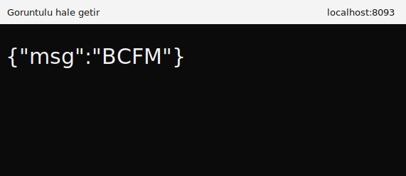
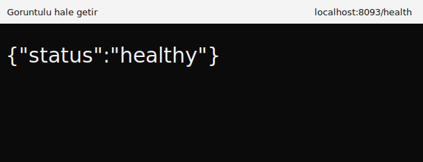

# BCFM Case


## Endpointler

- `GET /` -> `{"msg":"BCFM"}`
- `GET /health` -> `{"status":"healthy"}`
- `POST /post` -> Body'den gelen `key` ve `value` body'ye geri döndürülür.

## Goruntuler

### `/` Endpoint



### `/health` Endpoint



## Lokal Çalıştırma

```bash
python3 -m venv .venv
source .venv/bin/activate
pip install -r requirements.txt
python app.py
```

Uygulama varsayılan olarak `8093` portunda calışır.

## Docker

```bash
docker compose up -d --build
```

## Test Örnekleri

```bash
curl http://localhost:8093/
curl http://localhost:8093/health
curl -X POST http://localhost:8093/post \
  -H "Content-Type: application/json" \
  -d '{"key":"a","value":"b"}'
```
